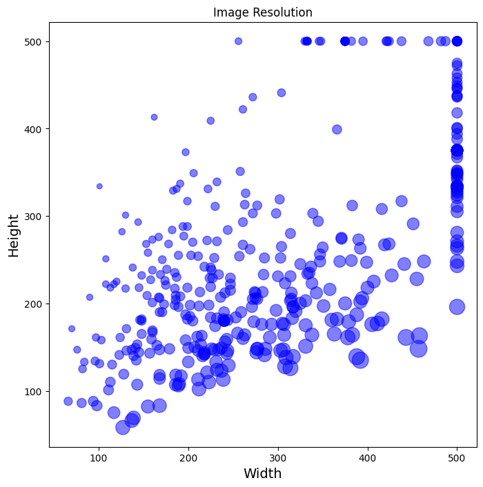

# Image Classification using Convolutional Neural Networks to Predict the Taxonomic Order of Sea Slugs Commonly Found Near Barcelona 

#### Muriel Cason Berkenstock 
 <br />


## Project Overview: 

  - Compile Training Data using "Fatkun Batch Download Image" Chrome extension 
    - #### Photo Sources: 
      - OPK Opistobranchis Database
      - iNaturalist 
      - Andrea Cabrito, Instituto de Ciencias del Mar
  - Generate Training and Testing Data  
  - Design Architecture of the Neural Netwrok 
  - Evalutate the Model 
  - Predict Model Output 
  - Use Streamlit to build Sea Slug Classifier App 


 <br />


 I decided to focus on classifying opistobranchs by the taxonomic order because members of each order can typically be discerned by shape or form, rather than by genetic or non-visual markers. Additionally, the model required around 500-1000 training photos in each class, which was often limited by photo availability, especially at the species level. 

  <br />


## Image Repository Architecture 
Images are organized into 5 classes within the critter_data repository and later split (20%) into training and testing data in python.


<br />

#### Classes were decided based on the findings of [Parera et al. 2020](https://www.researchgate.net/publication/342154530_Seaslugs_Mollusca_Gastropoda_Heterobranchia_the_other_inhabitants_of_the_city_of_Barcelona_Spain) and include: 

- Aplysiida
- Cephalaspidea 
- Runcinida 
- Nudibranchia
- Pleurobranchida
  
<br />

## Determining Network Parameters

### Deciding input size through Image Size Visualization: 
``` python 
# Get the Image Resolutions
root= 'critter_data/Cephalaspidea/'

imgs = [img.name for img in Path(root).iterdir() if img.suffix == ".jpg"]
img_meta = {}
for f in imgs: img_meta[str(f)] = imagesize.get(root+f)

# Convert it to Dataframe and compute aspect ratio
img_meta_df = pd.DataFrame.from_dict([img_meta]).T.reset_index().set_axis(['FileName', 'Size'], axis='columns', inplace=False)
img_meta_df[["Width", "Height"]] = pd.DataFrame(img_meta_df["Size"].tolist(), index=img_meta_df.index)
img_meta_df["Aspect Ratio"] = round(img_meta_df["Width"] / img_meta_df["Height"], 2)

```


#### Because larger inputs take more time and CPU to evaluate, I chose to begin with an input size of 150, incrementing by 50 until size 300 to optimize the input size.  

<br />

## Determining Color Scale
I ran models with either input colorscales of "rgb" (original color scale) or "grayscale" (black and white) in order to determine if the model would predict better without the effect of color, since opistobranchs of the same order can come in extremely variable colors and patterns. Depending on the color scale, the architecture of the model changed. 

## Designing Network Architecture 
Adding an "early stopper" to prevent overfitting: 
``` python 
earlystopping = callbacks.EarlyStopping(monitor ="val_loss", 
                                        mode ="min", patience = 5, 
                                        restore_best_weights = True)
``` 

## Evaluating the Model 

## Visualizing Performance 

## Predicting the Model Output
