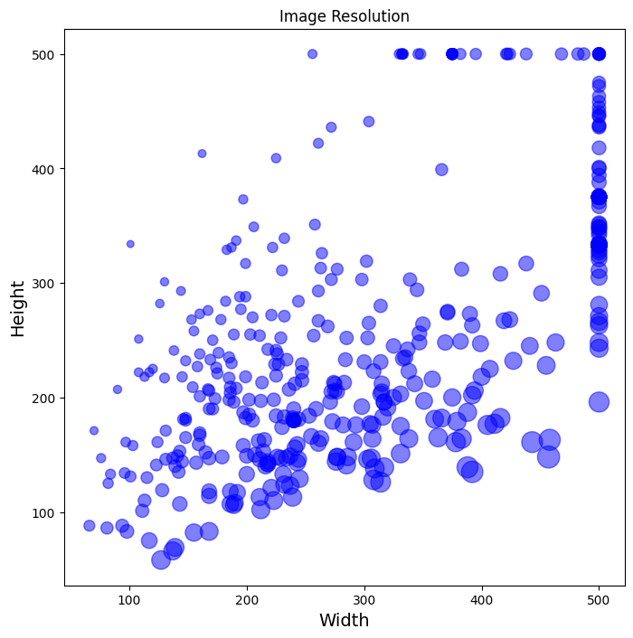
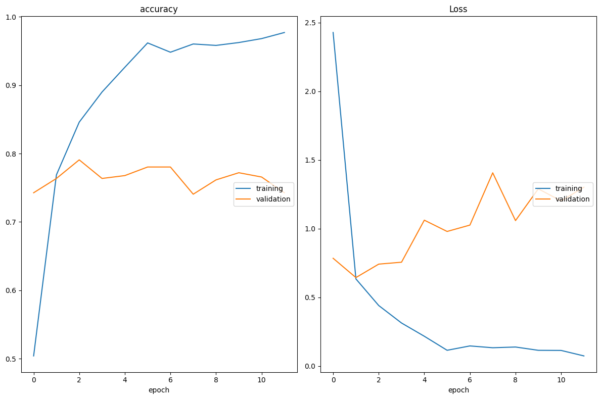
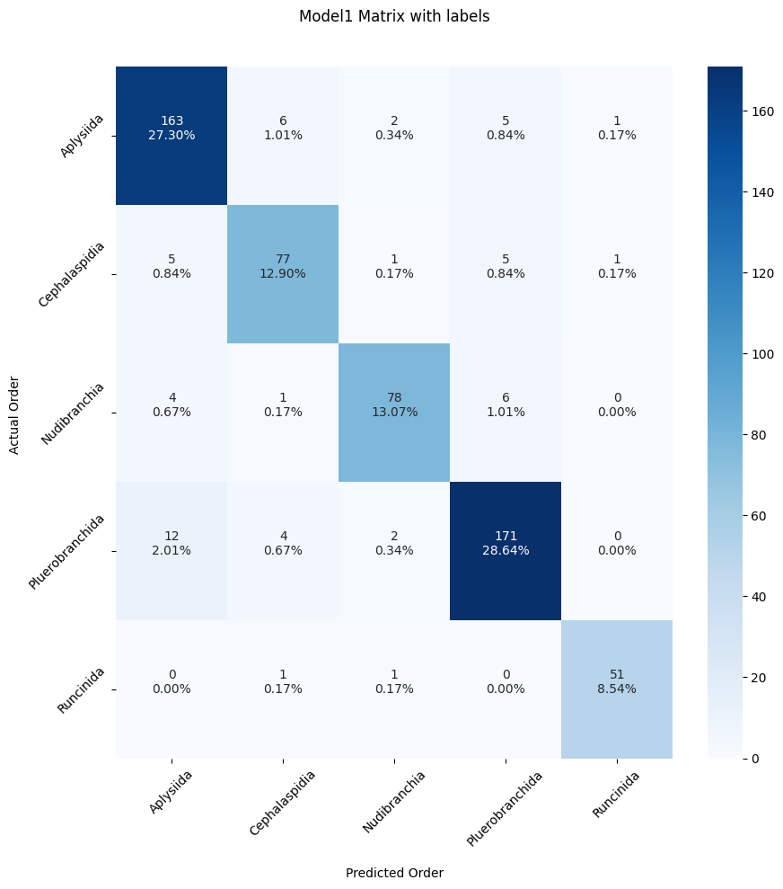
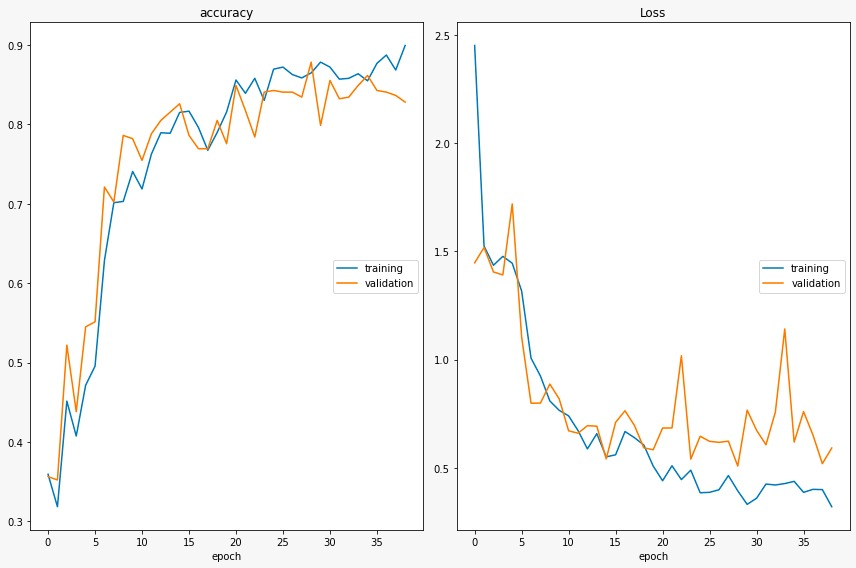

# Image Classification using a Convolutional Neural Network (VGG16) to Predict the Taxonomic Order of Opistobranchs  

#### Muriel Cason Berkenstock 
 <br />


## Project Overview: 

  - Compile Training Data using "Fatkun Batch Download Image" Chrome extension 
    - #### Photo Sources: 
      - OPK Opistobranchis Database
      - iNaturalist 
      - Andrea Cabrito, Instituto de Ciencias del Mar
  - Generate Training and Testing Data  
  - Design Architecture of the Neural Netwrok 
  - Evalutate the Model 
  - Predict Model Output 
  - Use Streamlit to build Sea Slug Classifier App 


 <br />


 I decided to focus on classifying opistobranchs by the taxonomic order because members of each order can typically be discerned by shape or form, rather than by genetic or non-visual markers. Additionally, the model required around 500-1000 training photos in each class, which was often limited by photo availability, especially at the species level. 

  <br />


## Image Repository Architecture 
Images are organized into 5 classes within the critter_data repository and later split (20%) into training and testing data in python.


<br />

#### Classes were decided based on the findings of [Parera et al. 2020](https://www.researchgate.net/publication/342154530_Seaslugs_Mollusca_Gastropoda_Heterobranchia_the_other_inhabitants_of_the_city_of_Barcelona_Spain) and include: 

- Aplysiida
- Cephalaspidea 
- Runcinida 
- Nudibranchia
- Pleurobranchida
  
<br />

## Determining Network Parameters

### Deciding input size through Image Size Visualization: 
``` python 
# Get the Image Resolutions
root= 'critter_data/Cephalaspidea/'

imgs = [img.name for img in Path(root).iterdir() if img.suffix == ".jpg"]
img_meta = {}
for f in imgs: img_meta[str(f)] = imagesize.get(root+f)

# Convert it to Dataframe and compute aspect ratio
img_meta_df = pd.DataFrame.from_dict([img_meta]).T.reset_index().set_axis(['FileName', 'Size'], axis='columns', inplace=False)
img_meta_df[["Width", "Height"]] = pd.DataFrame(img_meta_df["Size"].tolist(), index=img_meta_df.index)
img_meta_df["Aspect Ratio"] = round(img_meta_df["Width"] / img_meta_df["Height"], 2)

```


#### Because larger inputs take more time and CPU to evaluate, I chose to begin with an input size of 150, incrementing by 50 until size 300 to optimize the input size.  

<br />


## Determining Color Scale
I ran models with either input colorscales of "rgb" (original color scale) or "grayscale" (black and white) in order to determine if the model would predict better without the effect of color, since opistobranchs of the same order can come in extremely variable colors and patterns. Depending on the color scale, the architecture of the model changed. Upon using base model architectures VGG16, VGG19, and ResNet50, the model did not require a grayscale conversion.

## Designing Network Architecture and Parameters
I had to decide whether or not to use pretrained weights or to start from scratch with a more simple model. After running several architectures, it became evident that using the VGG16 base model trained on the imagenet dataset was optimal for this instance. Additionally using pretrained weights made the training process much less time consuming. VGG16 was optimal in my case as I had limited time and CPU. Working with VGG16, I set the input size to that of the VGG16 training imagenet dataset (224, 224, 3).

#### Loading the VGG16 weights
``` python
from tensorflow.keras.applications.vgg16 import VGG16

base_model = VGG16(weights="imagenet", include_top=False, input_shape=(224,224,3))
base_model.trainable = False ## Not trainable weights

```
#### Adding layers to the VGG16 base model 
``` python
from tensorflow.keras import layers, models

flatten_layer = layers.Flatten()
dense_layer_1 = layers.Dense(50, activation='relu')
dense_layer_2 = layers.Dense(20, activation='relu')
prediction_layer = layers.Dense(5, activation='softmax')


model = models.Sequential([
    base_model,
    flatten_layer,
    dense_layer_1,
    dense_layer_2,
    prediction_layer
])
``` 


#### Adding an "early stopper" to prevent overfitting: 
``` python 
from keras.callbacks import EarlyStopping
earlystopping = callbacks.EarlyStopping(monitor ="val_loss", 
                                        mode ="min", patience = 5, 
                                        restore_best_weights = True)
``` 
#### Adding "checkpoints" that save the best weights as the model trains 
``` python
from keras.callbacks import ModelCheckpoint 
tl_checkpoint_1 = ModelCheckpoint(filepath='model_ignore/tl_model_v1.weights.best.hdf5',
                                  save_best_only=True,
                                  verbose=1)
```
#### Plot the Accuracy and Loss as the Model Trains 
``` python 
from livelossplot.inputs.keras import PlotLossesCallback
plot_loss_1 = PlotLossesCallback()
```
##### In order to monitor the performance of the model, the following graphs were updated during the training  

###### The Model loss in the above figure indicates that the model was being overfitted. 


## Fine-Tuning the Model 
#### Creating a Model with a VGG16 base, Frozen layers during training, and 20% Dropout
``` python 
from keras.models import Model


def create_model(input_shape, n_classes, optimizer='rmsprop', fine_tune=0):
    """
    Compiles a model integrated with VGG16 pretrained layers
    
    input_shape: tuple - the shape of input images (width, height, channels)
    n_classes: int - number of classes for the output layer
    optimizer: string - instantiated optimizer to use for training. Defaults to 'RMSProp'
    fine_tune: int - The number of pre-trained layers to unfreeze.
                If set to 0, all pretrained layers will freeze during training
    """
    
    # Pretrained convolutional layers are loaded using the Imagenet weights.
    # Include_top is set to False, in order to exclude the model's fully-connected layers.
    conv_base = VGG16(include_top=False,
                     weights='imagenet', 
                     input_shape=input_shape)
    
    # Defines how many layers to freeze during training.
    # Layers in the convolutional base are switched from trainable to non-trainable
    # depending on the size of the fine-tuning parameter.
    if fine_tune > 0:
        for layer in conv_base.layers[:-fine_tune]:
            layer.trainable = False
    else:
        for layer in conv_base.layers:
            layer.trainable = False

    # Create a new 'top' of the model (i.e. fully-connected layers).
    # This is 'bootstrapping' a new top_model onto the pretrained layers.
    top_model = conv_base.output
    top_model = Flatten(name="flatten")(top_model)
    top_model = Dense(4096, activation='relu')(top_model)
    top_model = Dense(1072, activation='relu')(top_model)
    top_model = Dropout(0.2)(top_model)
    output_layer = Dense(n_classes, activation='softmax')(top_model)
    
    # Group the convolutional base and new fully-connected layers into a Model object.
    model = Model(inputs=conv_base.input, outputs=output_layer)

    # Compiles the model for training.
    model.compile(optimizer=optimizer, 
                  loss='categorical_crossentropy',
                  metrics=['accuracy'])
    
    return model
``` 
 

### Adding Data Augmentation to the Model
``` python 
BATCH_SIZE = 32

train_generator = ImageDataGenerator(rotation_range=90, 
                                     horizontal_flip=True, 
                                     vertical_flip=True,
                                     validation_split=0.20,
                                     preprocessing_function=preprocess_input) # VGG16 preprocessing

test_generator = ImageDataGenerator(preprocessing_function=preprocess_input) # VGG16 preprocessing

```

#### Generate predictions from the model 
``` python 
y_pred=model.predict(X_test)

# reshape output data 
y_pred=np.argmax(y_pred, axis=1)
y_test=np.argmax(y_test, axis=1)

#Generate the confusion matrix
cf_matrix = confusion_matrix(y_test, y_pred)

```


### After using preloaded weights from VGG16, freezing the convolutional layers, fine-tuning the last convolutional layer and the flatten layers, augmenting the data, and adding a dropout layer to mitigate overfitting:



 #### Final Model Accuracy: 90.45%